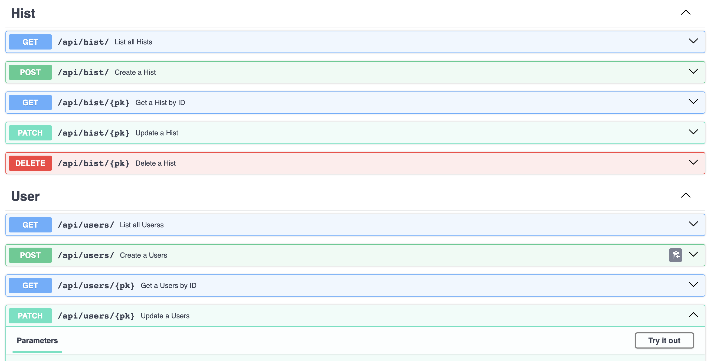
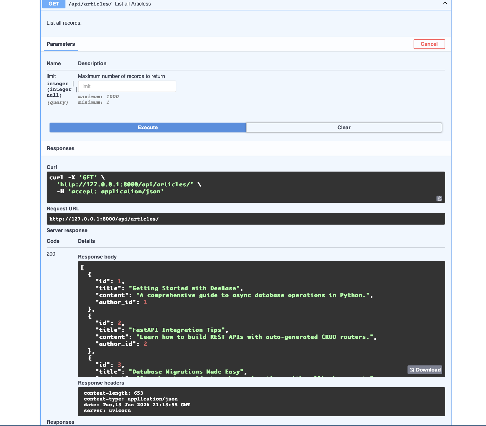
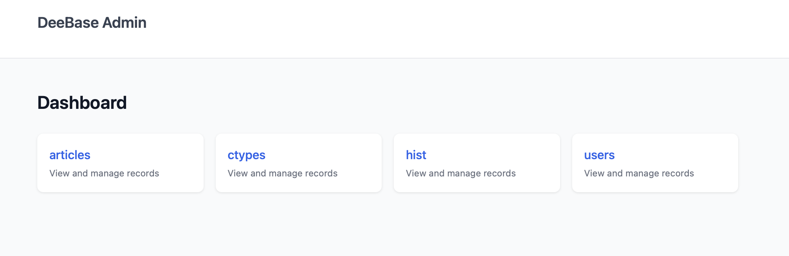
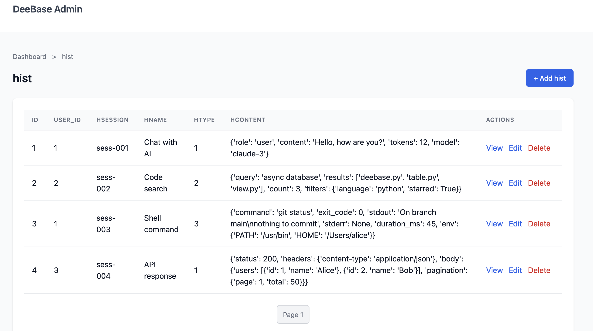
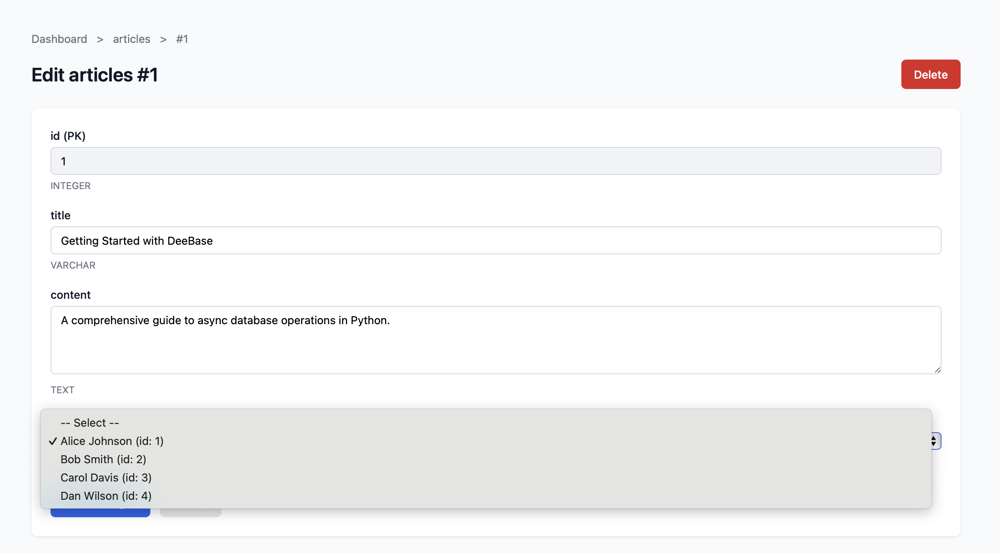

# FastAPI Integration Guide

DeeBase provides automatic REST API generation from your dataclass models using FastAPI. This guide covers everything from basic CRUD routers to advanced customization patterns.

## Table of Contents

1. [Quick Start](#quick-start)
2. [Generated Endpoints](#generated-endpoints)
3. [Pydantic Model Generation](#pydantic-model-generation)
4. [FK Validation](#fk-validation)
5. [Route Customization](#route-customization)
   - [Method 1: exclude - Remove Routes](#method-1-exclude---remove-routes)
   - [Method 2: overrides - Replace Handlers](#method-2-overrides---replace-handlers)
   - [Method 3: CRUDRouter Subclass - Hooks](#method-3-crudrouter-subclass---hooks)
6. [Custom Validators](#custom-validators)
7. [Exception Mapping](#exception-mapping)
8. [Admin Interface](#admin-interface)
9. [CLI Commands](#cli-commands)
10. [Complete Example](#complete-example)

## Quick Start

### Installation

```bash
pip install "deebase[api]"
# or
uv add "deebase[api]"
```

### Basic Usage

```python
from dataclasses import dataclass
from contextlib import asynccontextmanager
from fastapi import FastAPI
from deebase import Database, ForeignKey, Text
from deebase.api import create_crud_router

# Define models
@dataclass
class User:
    id: int                      # Auto-generated user ID
    name: str                    # Display name
    email: str                   # Email address
    status: str = "active"       # Account status

@dataclass
class Post:
    id: int                            # Auto-generated post ID
    author_id: ForeignKey[int, "user"] # Post author (FK validated)
    title: str                         # Post title
    content: Text                      # Post content
    published: bool = False            # Publication status

# Create database
db = Database("sqlite+aiosqlite:///blog.db")

# App lifespan for startup/shutdown
@asynccontextmanager
async def lifespan(app: FastAPI):
    await db.create(User, pk="id", if_not_exists=True)
    await db.create(Post, pk="id", if_not_exists=True)
    await db.enable_foreign_keys()
    yield
    await db.close()

# Create FastAPI app
app = FastAPI(title="Blog API", lifespan=lifespan)

# Add CRUD routers
app.include_router(create_crud_router(
    db=db,
    model_cls=User,
    prefix="/api/users",
    tags=["Users"],
))

app.include_router(create_crud_router(
    db=db,
    model_cls=Post,
    prefix="/api/posts",
    tags=["Posts"],
    validate_fks=True,
))

# Run: uvicorn app:app --reload
# Docs: http://localhost:8000/docs
```

## Generated Endpoints

`create_crud_router()` generates 5 REST endpoints:

| Method | Path | Description | Response |
|--------|------|-------------|----------|
| GET | `/` | List all records | `list[ResponseModel]` |
| GET | `/{pk}` | Get record by ID | `ResponseModel` |
| POST | `/` | Create new record | `ResponseModel` (201) |
| PATCH | `/{pk}` | Partial update | `ResponseModel` |
| DELETE | `/{pk}` | Delete record | 204 No Content |

These endpoints appear in the auto-generated Swagger UI at `/docs`:



The "Try it out" feature lets you test endpoints directly:



### Query Parameters

- **GET `/`**: Accepts `limit` query parameter (1-1000)
- **GET `/{pk}`**: Path parameter is the primary key value

## Pydantic Model Generation

Three Pydantic models are automatically generated from your dataclass:

```python
from deebase.api import generate_pydantic_models

UserCreate, UserUpdate, UserResponse = generate_pydantic_models(User)
```

| Model | Purpose | Fields |
|-------|---------|--------|
| `UserCreate` | POST request body | All fields except PK |
| `UserUpdate` | PATCH request body | All fields optional |
| `UserResponse` | Response body | All fields |

### Field Descriptions

Inline comments in your dataclass become OpenAPI field descriptions:

```python
@dataclass
class User:
    id: int              # Auto-generated user ID
    name: str            # Display name
    email: str           # Email address (unique)
```

In OpenAPI docs, `name` will show description "Display name".

### Class Docstrings

Class docstrings become model descriptions in OpenAPI:

```python
@dataclass
class Article:
    """Published articles in the blog."""
    id: int              # Article ID
    title: str           # Article title
    content: Text        # Full content
```

OpenAPI will show:
- `ArticleResponse` description: "Published articles in the blog."
- `ArticleCreate` description: "Published articles in the blog. (create request)"
- `ArticleUpdate` description: "Published articles in the blog. (update request)"

### CLI Integration

When creating tables via CLI, use `--description` and field docstrings:

```bash
deebase table create articles \
    id:int \
    'title:str:"Article title"' \
    'content:Text:"Full content"' \
    --pk id \
    --description "Published articles"
```

This generates `models/tables.py` with proper docstrings that flow through to OpenAPI.

## FK Validation

When `validate_fks=True`, DeeBase validates foreign key references before insert/update:

```python
app.include_router(create_crud_router(
    db=db,
    model_cls=Post,
    prefix="/api/posts",
    validate_fks=True,  # Enable FK validation
))
```

### Validation Error Response

```json
// POST /api/posts/ with {"author_id": 999, "title": "Hello"}
// Returns 422:
{
    "detail": {
        "type": "foreign_key_validation_error",
        "errors": [
            {
                "field": "author_id",
                "value": 999,
                "message": "Referenced user with id=999 does not exist"
            }
        ]
    }
}
```

This provides clearer error messages than database constraint failures.

## Route Customization

DeeBase offers **3 methods** to customize auto-generated routes, from simple to advanced:

### Method 1: exclude - Remove Routes

Remove routes you don't need. Best for read-only resources or restricted operations.

```python
# Read-only resource (no create, update, delete)
app.include_router(create_crud_router(
    db=db,
    model_cls=User,
    prefix="/api/users",
    exclude={"create", "update", "delete"},
))

# No delete (preserve records)
app.include_router(create_crud_router(
    db=db,
    model_cls=Category,
    prefix="/api/categories",
    exclude={"delete"},
))
```

**Available routes to exclude:** `"list"`, `"get"`, `"create"`, `"update"`, `"delete"`

### Method 2: overrides - Replace Handlers

Replace specific route handlers with custom functions. Best for adding query parameters, filtering, or custom logic without subclassing.

```python
from fastapi import Query

# Custom list handler with extra query parameters
async def custom_list(
    limit: int | None = Query(None, ge=1, le=100),
    status: str | None = Query(None, description="Filter by status")
):
    """List users with optional status filter."""
    table = db.t.user
    users = await table(limit=limit)
    if status:
        users = [u for u in users if u.status == status]
    return users

# Custom get handler that adds extra data
async def custom_get(pk):
    """Get user with additional metadata."""
    table = db.t.user
    user = await table[pk]
    # Add computed field
    user_dict = dict(user) if hasattr(user, '__dict__') else user
    user_dict["is_admin"] = user_dict.get("email", "").endswith("@admin.com")
    return user_dict

app.include_router(create_crud_router(
    db=db,
    model_cls=User,
    prefix="/api/users",
    overrides={
        "list": custom_list,
        "get": custom_get,
    },
))
```

**Handler Signatures:**

| Route | Signature |
|-------|-----------|
| `list` | `async def handler(limit: int \| None = Query(None))` |
| `get` | `async def handler(pk)` |
| `create` | `async def handler(data: YourCreateModel)` |
| `update` | `async def handler(pk, data: YourUpdateModel)` |
| `delete` | `async def handler(pk)` |

### Method 3: CRUDRouter Subclass - Hooks

For full control, subclass `CRUDRouter` and override hook methods. Best for audit logging, notifications, business rule enforcement, or data transformation.

```python
from deebase.api import CRUDRouter
from fastapi import HTTPException

class AuditedUserRouter(CRUDRouter):
    """User router with full audit trail and validation."""

    async def before_create(self, data: dict) -> dict:
        """Called before INSERT. Transform or validate data."""
        # Normalize email
        if "email" in data:
            data["email"] = data["email"].lower().strip()
        # Set default status
        data.setdefault("status", "pending")
        print(f"Creating user: {data.get('email')}")
        return data

    async def after_create(self, record: dict) -> dict:
        """Called after INSERT. Send notifications, log, etc."""
        # Send welcome email (pseudo-code)
        # await send_welcome_email(record["email"])
        print(f"User created: {record['id']}")
        return record

    async def before_update(self, pk, data: dict) -> dict:
        """Called before UPDATE. Validate changes."""
        if "email" in data:
            data["email"] = data["email"].lower().strip()
        print(f"Updating user {pk}")
        return data

    async def after_update(self, record: dict) -> dict:
        """Called after UPDATE."""
        print(f"User {record['id']} updated")
        return record

    async def before_delete(self, pk) -> None:
        """Called before DELETE. Check if deletion is allowed."""
        # Check for dependent records
        posts = await self.db.t.post(limit=1)
        user_posts = [p for p in posts if p.author_id == pk]
        if user_posts:
            raise HTTPException(
                status_code=400,
                detail="Cannot delete user with existing posts"
            )
        print(f"Deleting user {pk}")

    async def after_delete(self, pk) -> None:
        """Called after DELETE. Cleanup related data."""
        print(f"User {pk} deleted")

# Use the custom router
router = AuditedUserRouter(
    db=db,
    model_cls=User,
    prefix="/api/users",
    tags=["Users"],
)
app.include_router(router.router)
```

**Available Hooks:**

| Hook | When Called | Can Modify |
|------|-------------|------------|
| `before_create(data)` | Before INSERT | Input data |
| `after_create(record)` | After INSERT | Response |
| `before_update(pk, data)` | Before UPDATE | Input data |
| `after_update(record)` | After UPDATE | Response |
| `before_delete(pk)` | Before DELETE | (raise to block) |
| `after_delete(pk)` | After DELETE | - |

### When to Use Each Method

| Method | Use Case |
|--------|----------|
| **exclude** | Remove routes (read-only resources, restricted operations) |
| **overrides** | Add query parameters, custom filtering, transform responses |
| **CRUDRouter** | Audit logging, notifications, business rules, data validation |

## Custom Validators

Field validators transform or validate data before insert/update:

```python
app.include_router(create_crud_router(
    db=db,
    model_cls=Post,
    prefix="/api/posts",
    validators={
        # Strip whitespace and limit length
        "title": lambda v: v.strip()[:200] if v else v,
        # Normalize slug
        "slug": lambda v: v.lower().replace(' ', '-')[:50] if v else v,
        # Async validators work too
        "email": validate_email_async,
    },
))
```

## Exception Mapping

DeeBase exceptions are automatically mapped to HTTP status codes:

| DeeBase Exception | HTTP Status |
|-------------------|-------------|
| `NotFoundError` | 404 Not Found |
| `IntegrityError` | 422 Unprocessable Entity |
| `ValidationError` | 422 Unprocessable Entity |
| `ForeignKeyValidationError` | 422 Unprocessable Entity |
| `SchemaError` | 500 Internal Server Error |
| `ConnectionError` | 503 Service Unavailable |
| `InvalidOperationError` | 400 Bad Request |

## Admin Interface

DeeBase includes a Django-like admin interface for managing your data through a web UI.

### Enabling the Admin

```bash
# Prerequisites: initialize project and API structure
deebase init
deebase api init

# Start server with admin interface (no api generate needed!)
deebase api serve --admin

# Access at http://127.0.0.1:8000/admin/
```

**Note:** The admin interface uses database reflection to discover tables automatically. You do NOT need to run `deebase api generate` for the admin - it works with any existing tables in your database.

### Features

The admin interface provides:

- **Dashboard** - Lists all tables in your database
- **List View** - Paginated list of records with clickable rows
- **Detail View** - Read-only view of record data (Phase 17)
- **Create Form** - Form for creating new records
- **Edit Form** - Form for updating existing records
- **Delete Confirmation** - Safe deletion with confirmation page
- **FK Dropdowns** - Foreign key fields show dropdown menus populated from parent tables
- **Validation** - Uses project validators from `validators/` directory
- **Type-based Renderers** - JSON as formatted `<pre>`, booleans as Yes/No, etc. (Phase 17)
- **Custom Displays** - Override field rendering via `displays/` directory (Phase 17)

#### Dashboard



#### List View

Browse records with clickable rows that navigate to detail view:



#### Detail View (Phase 17)

Read-only view of a record with Edit/Delete buttons:

- JSON fields rendered as formatted `<pre>` blocks
- TEXT fields preserve line breaks
- Boolean fields shown as styled "Yes" / "No"
- NULL values shown with "—" marker

#### Edit Form with FK Dropdown

Foreign key fields automatically populate with options from the parent table:



### Admin URLs (Phase 17)

| URL | Description |
|-----|-------------|
| `/admin/` | Dashboard with table list |
| `/admin/{table}/` | List records (clickable rows) |
| `/admin/{table}/new` | Create new record form |
| `/admin/{table}/{pk}` | **Read-only detail view** |
| `/admin/{table}/{pk}/edit` | Edit record form |
| `/admin/{table}/{pk}/delete` | Delete confirmation |

**Phase 17 Changes:**
- `/{table}/{pk}` is now a read-only detail view
- Edit form moved to `/{table}/{pk}/edit`
- List view rows are clickable (navigate to detail)

### Programmatic Usage

You can also mount the admin router manually in your FastAPI app:

```python
from fastapi import FastAPI
from deebase import Database
from deebase.admin import create_admin_router

app = FastAPI()
db = Database("sqlite+aiosqlite:///app.db")

# Mount admin router at /admin/
app.include_router(create_admin_router(db))
```

### Validation with Admin

The admin interface automatically uses validators from your project's `validators/` directory:

```python
# validators/users.py
def validate_email(value: str) -> str:
    if "@" not in value:
        raise ValueError("Invalid email format")
    return value.lower()

VALIDATORS = {"email": validate_email}

# validators/__init__.py
from . import users

def get_validators(table_name: str) -> dict:
    registry = {"users": users.VALIDATORS}
    return registry.get(table_name, {})
```

When you create or edit records through the admin, these validators are applied automatically.

### Custom Display Functions (Phase 17)

The admin detail view uses type-based renderers by default. You can customize field rendering by creating display modules in the `displays/` directory:

```python
# displays/articles.py
"""Custom displays for the articles table."""
import html
import json

def render_tags(value, record):
    """Render tags array as styled badges."""
    if not value:
        return '<span class="null">—</span>'

    if isinstance(value, str):
        value = json.loads(value)

    badges = []
    for tag in value:
        escaped = html.escape(str(tag))
        badges.append(f'<span class="badge">{escaped}</span>')
    return " ".join(badges)

def render_status(value, record):
    """Render status with color coding."""
    colors = {
        "published": "#16a34a",
        "draft": "#ca8a04",
        "archived": "#6b7280",
    }
    color = colors.get(str(value).lower(), "#374151")
    return f'<span style="color:{color};font-weight:500;">{value}</span>'

# Export displays for the admin to discover
DISPLAYS = {
    "tags": render_tags,
    "status": render_status,
}
```

When initialized with `deebase init`, a `displays/` directory is created with example templates.

**Display Function Signature:**
```python
def render_field_name(value: Any, record: dict) -> str:
    """Return HTML string to display the field value."""
    ...
```

**Default Type Renderers:**

| Column Type | Rendering |
|-------------|-----------|
| JSON | Formatted `<pre>` block with syntax highlighting |
| TEXT | Preserves newlines (`<br>` tags) |
| BOOLEAN | Styled "Yes" / "No" |
| INTEGER | Monospace font |
| DATETIME | Formatted timestamp |
| NULL | Em dash (—) marker |

## CLI Commands

DeeBase provides CLI commands for API scaffolding:

```bash
# Initialize API structure (creates api/ directory)
deebase api init

# Generate router code from database tables (auto-wires routers)
deebase api generate users posts
deebase api generate --all

# Start development server
deebase api serve
deebase api serve --reload --port 8080

# Start with admin interface
deebase api serve --admin
deebase api serve --reload --admin

# Data management (no code needed)
deebase data list users
deebase data insert users -f name=Alice -f email=alice@example.com
deebase data get users 1
deebase data update users 1 -f status=inactive
deebase data delete users 1 -y
```

### Typical Workflows

**Seamless REST API (recommended):**

```bash
# 1. Initialize project
deebase init

# 2. Create tables (automatically generates models in models/tables.py)
deebase table create users id:int name:str email:str:unique --pk id
deebase table create posts id:int author_id:int:fk=users title:str content:text --pk id

# 3. Set up API structure
deebase api init

# 4. Generate routers (detects models, generates full CRUD automatically)
deebase api generate --all
# Output: Generated: api/routers/users.py (full CRUD with User)
#         Generated: api/routers/posts.py (full CRUD with Post)

# 5. Start server - full REST API ready!
deebase api serve
```

**Admin Interface Only (no generated routers needed):**

```bash
# 1. Initialize project and create tables
deebase init
deebase table create users id:int name:str email:str --pk id

# 2. Set up API structure
deebase api init

# 3. Start server with admin (uses reflection, no api generate needed)
deebase api serve --admin
```

**Both REST API and Admin:**

```bash
deebase init
deebase table create users id:int name:str email:str --pk id
deebase api init
deebase api generate --all
deebase api serve --admin  # REST endpoints + admin interface
```

**Key Points:**

- `deebase table create` automatically generates dataclass models in `models/tables.py`
- `deebase api generate` detects these models and generates fully-wired CRUD routers
- No manual code editing needed for standard CRUD workflows
- The `api/routers/__init__.py` file is auto-generated - do not edit manually
- To customize routers, edit individual files in `api/routers/` after generation

## Complete Example

See the full working examples:

- **[examples/phase15_fastapi.py](../examples/phase15_fastapi.py)** - All features demonstrated
- **[examples/complete_blog_api_example.py](../examples/complete_blog_api_example.py)** - Full blog API with HTML routes
- **[examples/phase16_data_admin.py](../examples/phase16_data_admin.py)** - Validation layer and admin interface
- **[examples/complete_example_with_validation.py](../examples/complete_example_with_validation.py)** - Blog with validation
- **[examples/phase17_admin_enhancements.py](../examples/phase17_admin_enhancements.py)** - Admin UI enhancements (detail view, renderers)

Run them:

```bash
# Phase 15 feature demo
uv run examples/phase15_fastapi.py

# Complete blog API (uses TestClient, no server needed)
uv run examples/complete_blog_api_example.py

# Phase 17 admin enhancements
uv run examples/phase17_admin_enhancements.py
```

## API Reference

### create_crud_router()

```python
def create_crud_router(
    db: Database,
    model_cls: type,
    *,
    table_name: str | None = None,
    prefix: str = "",
    tags: list[str] | None = None,
    pk_field: str = "id",
    validate_fks: bool = True,
    validators: dict[str, Callable] | None = None,
    exclude: set[str] | None = None,
    overrides: dict[str, Callable] | None = None,
    response_model_exclude: set[str] | None = None,
) -> APIRouter
```

| Parameter | Type | Default | Description |
|-----------|------|---------|-------------|
| `db` | `Database` | required | DeeBase Database instance |
| `model_cls` | `type` | required | Dataclass model class |
| `table_name` | `str` | class name lowercase | Database table name |
| `prefix` | `str` | `""` | URL prefix (e.g., `/api/users`) |
| `tags` | `list[str]` | `[class name]` | OpenAPI tags |
| `pk_field` | `str` | `"id"` | Primary key field name |
| `validate_fks` | `bool` | `True` | Validate FK references |
| `validators` | `dict` | `None` | Field validators |
| `exclude` | `set[str]` | `None` | Routes to exclude |
| `overrides` | `dict` | `None` | Route handlers to override |

### CRUDRouter

```python
class CRUDRouter:
    def __init__(
        self,
        db: Database,
        model_cls: type,
        *,
        # Same parameters as create_crud_router
    )

    # Hook methods to override
    async def before_create(self, data: dict) -> dict: ...
    async def after_create(self, record: dict) -> dict: ...
    async def before_update(self, pk, data: dict) -> dict: ...
    async def after_update(self, record: dict) -> dict: ...
    async def before_delete(self, pk) -> None: ...
    async def after_delete(self, pk) -> None: ...

    # The FastAPI router
    @property
    def router(self) -> APIRouter: ...
```

### generate_pydantic_models()

```python
def generate_pydantic_models(
    model_cls: type,
    pk_field: str = "id",
    fk_metadata: list[dict] | None = None,
) -> tuple[type, type, type]:
    """Returns (CreateModel, UpdateModel, ResponseModel)"""
```
